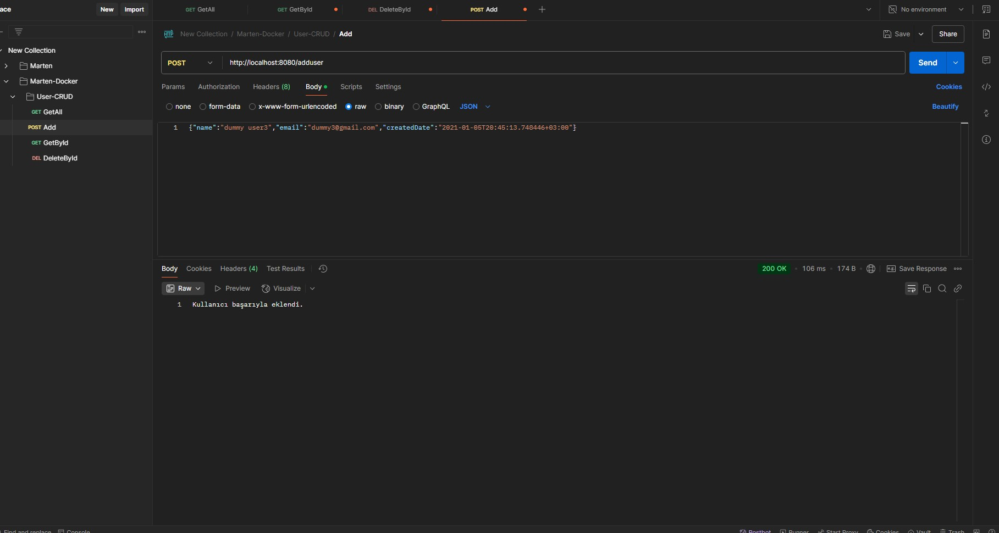

# .NET Minimal API with PostgreSQL and Docker Compose

Bu proje, JSON verilerini anahtar-değer çiftleriyle saklamak için **PostgreSQL** ve **Marten** kullanarak bir .NET Minimal API sunmaktadır. Proje Docker Compose kullanılarak konteynerlerde çalıştırılabilir.

## Proje İçeriği

- **API Projesi**: Anahtar-değer çiftlerini almak, eklemek ve silmek için HTTP isteklerini yöneten Minimal API.
- **Service Projesi**: Veritabanı işlemleri ve iş mantığını yöneten servis katmanı.
- **Docker**: Dockerfile ve docker-compose.yaml dosyaları ile projeyi konteynerlere yerleştirip çalıştırmak.

## Gereksinimler

- **Docker** ve **Docker Compose**: Bu proje, tüm bağımlılıklarıyla birlikte Docker konteynerlarında çalışır.
  - [Docker'ı Yükleyin](https://docs.docker.com/get-docker/)
  - [Docker Compose'u Yükleyin](https://docs.docker.com/compose/install/)

## Projeyi Çalıştırma

1. **Docker ve Docker Compose'u Yükleyin**: Eğer sisteminizde yüklü değilse, [Docker'ı ve Docker Compose'u](https://docs.docker.com/get-docker/) yükleyin.

2. **Projeyi Klonlayın**:
    ```bash
    git clone https://github.com/kullanici_adiniz/proje_adi.git
    cd proje_adi
    ```

3. **Docker Compose ile Çalıştırın**:
    Projeyi başlatmak için `docker-compose up --build` komutunu çalıştırın. Bu komut Dockerfile'ı kullanarak API'yi ve PostgreSQL servisini çalıştıracak.
    ```bash
    docker-compose up --build
    ```

4. **Uygulamaya Erişim**:
    - API'yi [http://localhost:8080](http://localhost:8080) üzerinden test edebilirsiniz.
    - API'ye **GET**, **POST** ve **DELETE** istekleri göndererek veritabanı işlemlerini test edebilirsiniz.

## API Endpoint'leri

API'niz aşağıdaki endpoint'leri sağlar:

- **GET /getallusers**  
    - Açıklama: Tüm kullanıcıları listeler.
    - Örnek İstek:  
      ```bash
      GET http://localhost:8080/getallusers
      ```
    - Yanıt:  
      ```json
      [
        {
          "id": 1,
          "name": "John Doe",
          "email": "john.doe@example.com",
          "createdDate": "2021-01-01T00:00:00"
        },
        ...
      ]
      ```

- **GET /user/{id}**  
    - Açıklama: Belirtilen ID'ye sahip kullanıcıyı getirir.
    - Parametreler: `{id}` – Kullanıcı ID'si
    - Örnek İstek:  
      ```bash
      GET http://localhost:8080/user/1005
      ```

- **POST /adduser**  
    - Açıklama: Yeni bir kullanıcı ekler veya var olan bir kullanıcıyı günceller.
    - JSON Gövde Formatı:
      ```json
      {
        "name": "dummy user2",
        "email": "dummy2@gmail.com",
        "createdDate": "2021-01-05T20:45:13.748446+03:00"
      }
      ```
    - Örnek İstek:  
      ```bash
      POST http://localhost:8080/adduser
      Content-Type: application/json
      Body:
      {
        "name": "dummy user2",
        "email": "dummy2@gmail.com",
        "createdDate": "2021-01-05T20:45:13.748446+03:00"
      }
      ```

- **DELETE /deleteUser/{id}**  
    - Açıklama: Belirtilen ID'ye sahip kullanıcıyı siler.
    - Parametreler: `{id}` – Silinecek kullanıcı ID'si
    - Örnek İstek:  
      ```bash
      DELETE http://localhost:8080/deleteUser/1
      ```

## Teknolojiler

Bu proje aşağıdaki teknolojilerle geliştirilmiştir:

- **.NET 8 Minimal API**: API'yi geliştirmek için kullanılan framework.
- **Marten**: PostgreSQL üzerinde JSON veri işlemleri için kullanılan kütüphane.
- **Docker ve Docker Compose**: Uygulamayı konteynerlere yerleştirip çalıştırmak için kullanılır.

## Lisans

Bu proje **MIT Lisansı** altında lisanslanmıştır. Detaylar için `LICENSE` dosyasına bakabilirsiniz.

## Postman Example




